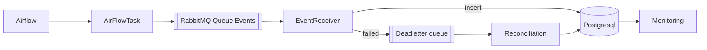
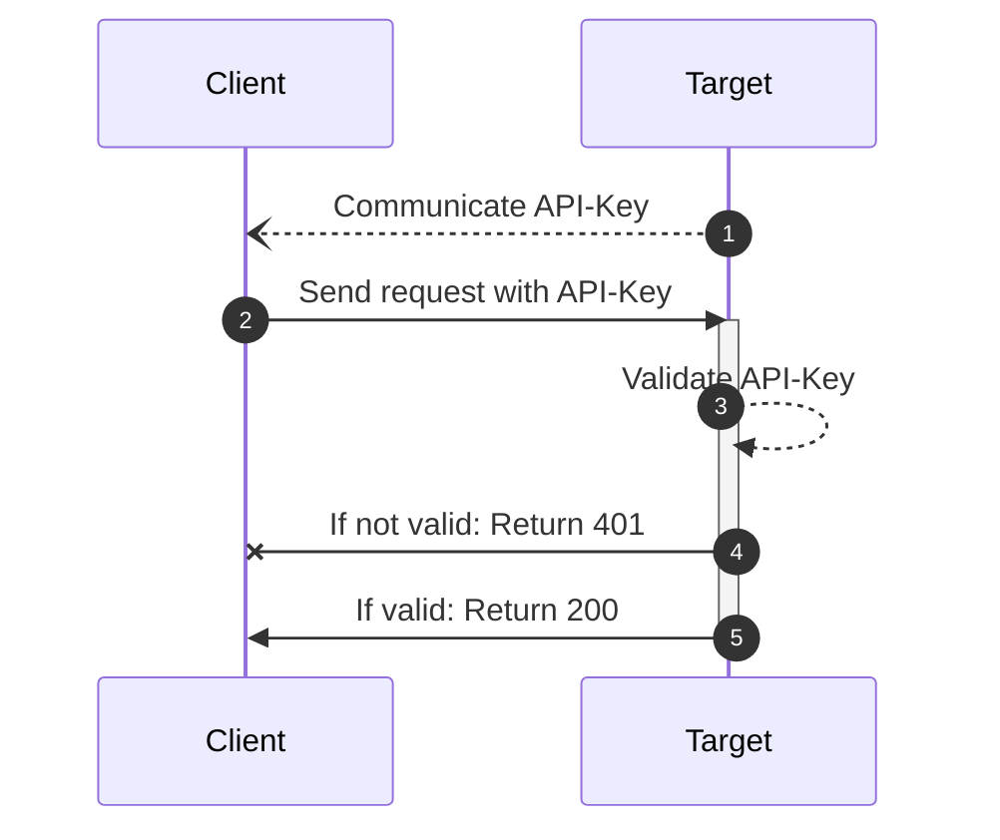

Title: Software Architecture illustrations
Published: 16/11/2022 20:10
Tags: [Thoughts, Architecture] 
---

# Illustrations in Software architecture 
In software architecture, I find myself reaching more and more for tools that I can use to generate representations from a simple textual description, be it generated from a tool or hand written. And sometimes, nothing generated looks nice, so I have to do draw it myself! 

Here are a few of the tools I have recently used, for different purposes:

## Diagrams as code: 
### Mermaid 
Mermaid is a language to generate flow charts, pie charts, entity relation diagrams and several other diagrams. I’ve used it in internal documentation and blog posts. The graph description language is simple enough that you can write code to generate charts, too. 

- https://mermaid-js.github.io/mermaid/#/

A live editor is also available online:

- https://mermaid.live/

Mermaid rendering has been integrated into several markdown renderers, GitHub markdown and VS Code both support it. 







### Python Diagrams 

Python has a diagram library which has icons for most programming tools, from Airflow to ZeroMQ. You design the diagram with simple Python code and it uses the Graphviz library to render png images. Highly recommended for small architecture diagrams that just need a dozen or so elements. 

- https://diagrams.mingrammer.com/

I’ve also done some pull requests to add symbols to the library and I recommend you do so too if you have elements that are missing in your diagrams. 

```python
## pip install diagrams
## winget install -e --id Graphviz.Graphviz
## set PATH=C:\Program Files\Graphviz\bin;%PATH%
#
# Architecture of the docker-compose using a chart generated in py

from diagrams import Diagram, Cluster
from diagrams.onprem.inmemory import Redis
from diagrams.onprem.database import Postgresql
from diagrams.onprem.queue import Rabbitmq
from diagrams.programming.language import PHP
from diagrams.programming.language import Csharp
from diagrams.onprem.client import Users
from diagrams.onprem.network import Nginx

with Diagram("Composed Docker", show=False):
    users = Users("users")
    
    with Cluster("Front-End"):
        web = Nginx("ngweb")
        php = PHP("php")

    with Cluster("Back-Ends"):
        redis = Redis("cache")
        rabbit = Rabbitmq("rabbit")
        listener = Csharp("listener")
        db = Postgresql("db")
    
    users >> web >> php >> rabbit >> listener >> db
    php >> redis
```

{ width=80% }

### PlantUML 
The big one! Plant UML has a ton of diagrams, the language is maybe a bit more obscure and complicated than mermaid, but you gain a lot from PlantUML when you actually need those features. 

- https://plantuml.com/ 

PlantUML also has a live editor online: 

- https://www.plantuml.com/plantuml/uml/

Actually, I’ve used it quite seldomly, being able to cover most requirements with Mermaid and Python Diagrams. 

## Diagrams as Drawing:
### Diagrams 
Diagrams.net has both an online and an offline version of a vector drawing software that works exceedingly well for software architecture illustrations. With symbols for most public cloud platforms included in their delectable libraries, you’ll be able to find the right symbol you need. 

- https://www.diagrams.net/

There’s even a Visual Studio Code extension for editing a diagram inside the IDE. Export can be done to PNG easily. Diagrams produced are easily embedded in Atlassian’s wiki and other wiki products.

Highly recommend if you need to place your architecture elements instead of relying on the auto layout of diagrams as code. Now I just wish that the diagrams as code tools could create a diagram baseline compatible with this tool to modify the layout. 


### Archi (Archimate modelling) 
If you use the [Archimate modelling language](https://en.m.wikipedia.org/wiki/ArchiMate), then this is the tool for you to build your modelling concepts. The formalism is great for making something that everyone can “read” once trained on it, but the investment can be quite high to do the correct modelling of your infrastructure with this tool.

- https://www.archimatetool.com/

I used the Local application running on Windows. 

#### Online architecture repositories 
There is also online hosted versions of architecture repository tools using Archimate [Adoit EA Suite](https://www.boc-group.com/en/adoit/) and an associated community version too. 

Alternatively, there's also: 

- [Hopex's MEGA](https://www.mega.com/hopex-platform) which I only used as it was being decommissioned
- [Sparx Systems’ Enterprise Architect](https://sparxsystems.com/products/ea/index.html) which I used for a short amount of time before the company standardised on Adoit. 

### yEd 
In writing this article, I discovered the tool yEd and wanted to mention it for completeness, I haven't had the opportunity to use it yet. It does mention many of the illustration types that are useful (BPML, Flowcharts, UML, ...). 

- https://www.yworks.com/products/yed

## Diagrams from programming:

Now these are more out there and not always directly applicable, but when you need a visualisation that the above tools cannot do, it’s time to break out these applications.

### D3js 
Not sure if I need to introduce D3js,  it is probably one of the most commonly use and important is visualisation libraries. Used in everything from maps to genomics to economic data. It can do it all. 

https://d3js.org/ 

I previously used d3js to embed charts of price curves generated from market data, overlapped with the delivery period of energy instruments. 

### Processing.js  
Animated heart pulsating on a field of scintillating gold lace? Yes. That and many more things! Processing excels in the visual demos, animations and more. You’ll have to code it, but it’s no issue to get your custom Mandelbrot animated render and many more. Has interactions with sound and many more features. Does have a high bar of entry though and it takes a while to be productive with it. 

- https://processing.org/

### Graphviz 
I would be remiss if I didn’t mention Graphviz. It is the library used to generate diagrams from textual descriptions using one of their many languages, Dot being one of them. 

Not something I use directly but more indirect usages via the Python diagrams library. You can learn it’s language and create charts. 

- https://graphviz.org/

## Online services (collaborative)
When you need online collaboration, which the tools above do not cover, you can turn to the following services. 

### Miro
I’ve had the most experience with Miro while running large organisation meetings as a place to collect ideas, do feedback rounds and generally plan activities. 

- https://miro.com

### LucidSpark, LucidChart and LucidScale
Both collaboration and vector illustration online software. Also their ability with lucid scale to connect and document your cloud infrastructure is very impressive and helps to keep you infrastructure maps updated. 

- https://www.lucidspark.com/
- https://www.lucidscale.com/
- https://www.lucidchart.com/

Sadly, it’s one that I’ve not had the opportunity to use very often, usually because it was covered by other tools and no one else in the company was using it. But you should check it out to see if it does work for you and your team. 

### Microsoft Whiteboard 
When all else fails, there’s Microsoft whiteboard. It works, there’s an online version, an integration in teams, a desktop app and even an iOS / iPadOS application. More suited to drawing with a pen, then it becomes a great collaborative whiteboard. I have given internal talks using a Microsoft Whiteboard as a backdrop. I really like to start small and progressively zoom out on these massive canvases. 

https://www.microsoft.com/en-us/microsoft-365/microsoft-whiteboard/digital-whiteboard-app

## Mind maps 
I don't use mind maps very often anymore. I was taught to use them as a child, but haven't kept up the practice. I'm just adding a couple of references in case you are looking for them: 

### vscode-mindmap 
I've used vscode-mindmap when I needed to create a quick hierarchy map. 

- https://marketplace.visualstudio.com/items?itemName=pmcxs.vscode-mindmap

## Conclusion 

There’s no one tool for everything in this day and age. Use what works for you and try out several to see if they stick! 

I highly recommend generating some charts in mermaid from your own database ER-Diagram (easy to do!) or using it to make pie charts like [Microsoft Polyglot notebooks demonstrates at 15:05 onwards](https://youtu.be/IXRGa5m-Lbo) in their [GitHub demo notebook](https://github.com/dotnet/interactive/blob/main/samples/notebooks/polyglot/github%20repo%20milestone%20report.ipynb). 

If you have other recommendations for me, do feel free to reach out and I’ll see if they make to cut to get added to this list. :) You can even pull request this actual blog post on GitHub.

Finally, if someone has a recommendation for a WAN/LAN topology visualisation or charting tool, I’d be happy to hear about it and your experience with it! 